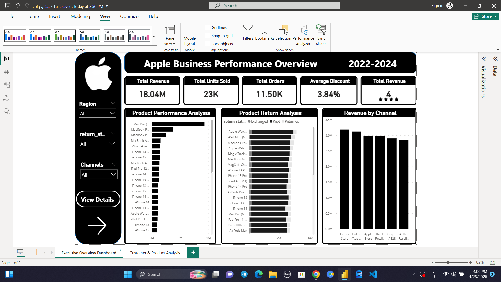
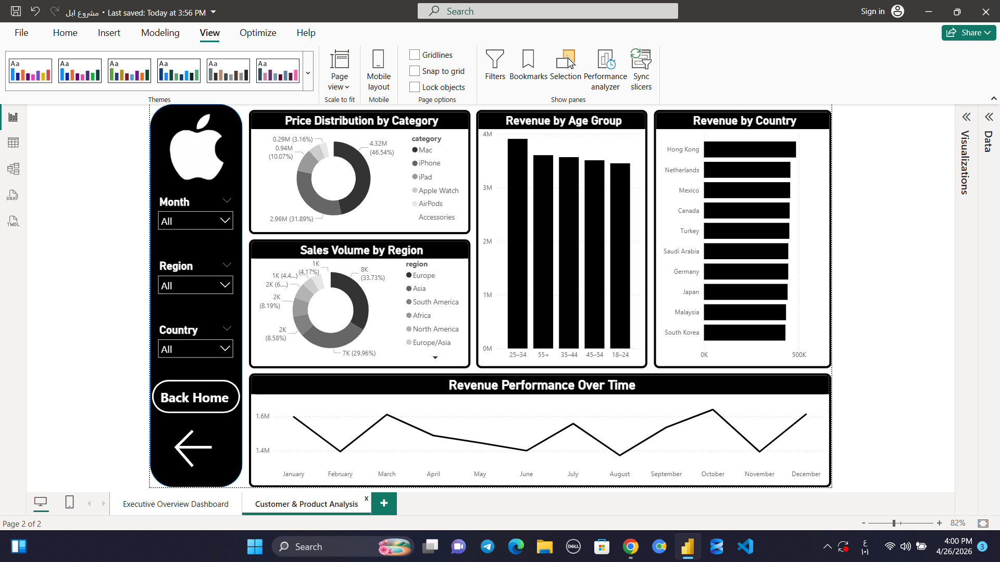

# 🍎 Apple Sales & Performance Analysis Dashboard

## 📌 Project Overview
This project is a comprehensive data analysis case study focused on Apple’s sales performance across multiple dimensions including products, regions, customer segments, and sales channels.

The goal of this project was not just to build a dashboard, but to deeply analyze business performance, identify hidden patterns, detect weaknesses, and provide actionable insights that can improve revenue, efficiency, and strategic decision-making.

This project represents a real-world business intelligence scenario where raw data is transformed into meaningful insights that directly support executive-level decisions.

---

## ❗ Business Problem

Before this analysis, Apple faced several challenges in understanding its sales ecosystem:

- Lack of unified visibility across sales channels  
- Difficulty in identifying top-performing and underperforming products  
- Limited insight into customer behavior across age groups and countries  
- No clear understanding of return patterns and their impact on revenue  
- Weak visibility into discount strategy effectiveness  
- Inability to track performance trends over time effectively  

These gaps made it difficult to optimize pricing strategy, marketing efforts, and product positioning.

---

## 🛠️ My Role & What I Did

In this project, I acted as a Data Analyst responsible for turning raw sales data into actionable business intelligence.

### 🔹 Data Preparation
- Cleaned and structured raw datasets  
- Handled missing values and inconsistencies  
- Standardized categories across products, regions, and channels  

### 🔹 Data Analysis
- Performed deep exploratory data analysis (EDA)  
- Identified patterns in revenue, sales volume, and customer segments  
- Analyzed return behavior and its impact on profitability  
- Studied discount effectiveness on overall sales performance  

### 🔹 Dashboard Development
- Built an interactive and dynamic dashboard  
- Designed KPIs for executive-level reporting  
- Created multi-dimensional analysis views (product, region, time, customer)  
- Ensured clarity, usability, and business relevance  

---

## 📊 Key Performance Indicators (KPIs)

The dashboard includes the following KPIs:

1. Total Revenue  
2. Total Units Sold  
3. Total Orders  
4. Average Discount  
5. Total Revenue (Star Rating Impact Analysis)  
6. Product Performance Analysis  
7. Product Return Analysis  
8. Revenue by Channel  
9. Price Distribution by Category  
10. Sales Volume by Region  
11. Revenue by Age Group  
12. Revenue by Country  
13. Revenue Performance Over Time  

---

## 📈 Business Insights & Findings

### 🔴 Key Problems Identified
- Certain products generate high sales but also high return rates  
- Discounts were not always positively impacting revenue  
- Some regions showed strong demand but weak profitability  
- Certain customer age groups contributed disproportionately to revenue  
- Performance varied significantly across sales channels  

### 🟢 Opportunities Discovered
- Optimizing high-return products can significantly improve profit margins  
- Targeted marketing by age group can increase conversion rates  
- Regional strategy adjustment can unlock hidden revenue potential  
- Better pricing strategy can reduce unnecessary discount losses  
- Channel optimization can improve overall sales efficiency  

---

## 🚀 Business Impact

This analysis provided Apple (as a simulated business case) with:

- 📊 Clear visibility into sales performance across all dimensions  
- 💡 Data-driven understanding of customer behavior  
- 📉 Identification of revenue leakage points (returns & discounts)  
- 📈 Better product strategy based on performance data  
- 🎯 Improved decision-making for marketing and pricing strategies  

### 💰 Expected Impact on Business:
- Increase in revenue through optimized product focus  
- Reduction in return-related losses  
- Improved profit margins via better discount control  
- Stronger regional and channel performance targeting  
- More efficient inventory and sales planning  

---

## 🛠️ Tools & Technologies Used
- Power BI / Tableau  
- Microsoft Excel  
- Data Cleaning & Transformation  
- Data Visualization & Storytelling Techniques  

---

## 📊 Dashboard Preview

### 🔹 Overview Dashboard

### 🔹 Deep Analysis Dashboard

---

## 🎯 Final Conclusion

This project demonstrates how raw sales data can be transformed into powerful business intelligence that supports strategic decision-making.

By analyzing Apple’s sales from multiple perspectives—products, customers, regions, and channels—this project successfully uncovered hidden insights that can significantly improve revenue performance, reduce operational inefficiencies, and optimize overall business strategy.

---

## 🔥 Key Takeaway
Data is not just numbers — it is a story.  
And this project tells the story of how Apple’s performance can be improved using data-driven decisions.
